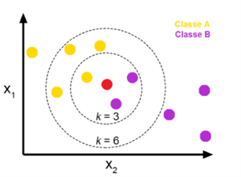
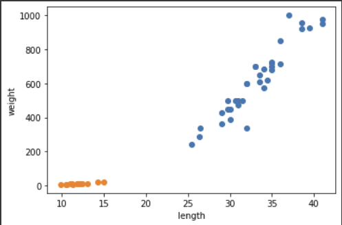
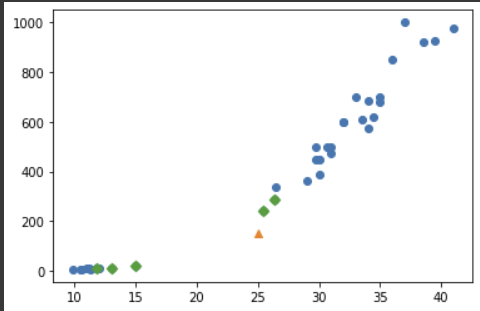
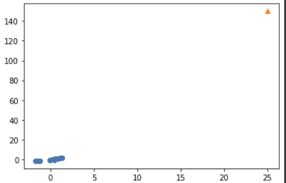
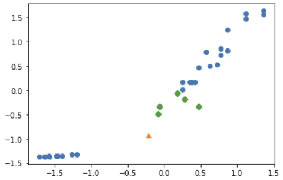

# KNN 알고리즘 개요

- 개념 : 어떤 데이터가 주어지면 그 주변의 데이터를 살펴본 뒤 더 많은 데이터가 포함되어 있는 범주로 분류하는 방식
- 특징 : 훈련 데이터를 저장하는 것이 훈련의 전부이다.


<br/>
<br/>
</br>
# 혼공머신 - knn 알고리즘을 이용한 생선 분류

## **데이터 살펴보기**
<br/></br>


왼쪽 영역에 분포하는 데이터가 빙어, 오른쪽 영역에 분포하는 데이터가 도미를 의미한다.

앞으로 사용할 데이터를 다음과 같이 정의한다.
<br/></br>
```python
length = bream_length + smelt_length
weight = bream_weight + smel_weight

fish_data = [[l, w]] for l,w in zip(length, weight)

# 1: 도미, 2: 빙어
# 35 개의 도미 데이터와 14개의 빙어 데이터를 사용한다.
fish_target = [1]*35 + [0]*14

```
<br/></br>
## knn 알고리즘을 이용한 도미 빙어 데이터 구분
<br/></br>
사이킷 런의 KneighborsClassifer 를 통해 knn 알고리즘을 사용할 수 있다.
```python
from sklearn.neighbors import KNeighborsClassifier

# KNN 객체 생성
kn = KNeighborsClassifier(n_neighbors=49)
# fit() : 주어진 데이터로 알고리즘을 훈련 
kn.fit(fish_data, fish_target)
# score() : 0~1 사이의 값 반환
kn.score(fish_data, fish_target)
```
<br/></br>
## **훈련 세트 & 데이터 세트 분리**
<br/></br>
혼공머신 Chapter1,2 에서는 다음의 두 가지 방식으로 훈련 데이터와 테스트 데이터를 분류한다.

- 각 데이터의 index를 랜덤으로 정렬해서 데이터를 임의로 뽑아내는 방식으로 훈련 데이터와 테스트 데이터를 분류한다.
- 사이킷런의 train_test_split 을 사용한다.

두 번째 방식으로 데이터를 분리하는 것이 깔끔하다.

```python
from sklearn.model_selection import train_test_split

train_input, test_input, train_target, test_target = train_test_split(fish_data,     fish_target, random_state = 42)
```
<br/></br>
## **데이터 학습**
<br/></br>
데이터 전처리를 거치지 않고 일단, train data / test data 분리 된 것을 훈련시켰을 때 다음과 같은 결과가 나온다.

*코드*
```python
kn = KNeighborsClassifier()
# train
kn.fit(train_input, train_target)
# test
kn.score(test_input, test_target)

# (25, 150) 특성 값을 가지는 데이터를 예측해보자.
kn.predict([[25,150]])         >>> 결과값은 빙어(0) 를 가리킨다.

# 최근접 이웃을 확인해보자.
# import matplotlib.pyplot as plt
plt.scatter(train_input[:, 0], train_input[:,1])
plt.scatter(25, 150, marker='^')
# 최근접 이웃 표시
plt.scatter(train_input[indexes,0], train_input[indexes,1], marker='D')
plt.show()
```



> 최근접 이웃 k = 5로 지정했을 때 과반수 이상의 3 개의 이웃이 빙어 데이터를 가리키므로 산접도 상 샘플 데이터는 도미에 가깝지만 빙어로 예측하게 된다. 이를 해결하기 위해 데이터 전처리 과정을 거쳐야 한다.

<br/></br>

## **데이터 전처리**
<br/></br>
z-표준점수 정규화 방법을 사용한다. 즉, 다음의 수식을 활용한다.

$$z = \frac{자료 값 - 평균}{표준편차}$$

*코드*
```python
# 평균, 표준편차
# import nupmy as np
mean = np.mean(train_input, axis=0)
std = np.std(train_input, axis=0)

# 전처리 데이터
train_scaled = (train_input - mean) / std

# 전처리 데이터로 모델 훈련
plt.scatter(train_scaled[:,0], train_scaled[:,1])
# 전처리 데이터와 마찬가지로 테스트 데이터도 전처리 해야됨.
plt.scatter(25, 150,marker='^') 
plt.show()
```
*결과*


> 빙어 데이터 와 샘플 데이터의 차이가 뚜렷해졌다. 

<br/></br>
## **전처리 데이터로 모델 훈련**
<br/></br>
*코드*
```python
new_sample_scaled = ([25, 150] - mean) / std
plt.scatter(train_scaled[:,0], train_scaled[:,1])
plt.scatter(new_sample_scaled[0], new_sample_scaled[1])

# 최근접 이웃 표시
distances, indexes = kn.kneighbors([new_sample_scaled])
plt.scatter(train_scaled[:,0], train_scaled[:,1])
plt.scatter(new_sample_scaled[0], new_sample_scaled[1], marker='^')
plt.scatter(train_scaled[indexes, 0], train_scaled[indexes, 1], marker='D')
plt.show()

```

*결과*


<br/></br>
최근접 이웃 모두 도미 데이터 이미로 샘플 데이터 역시 '도미' 로 예측하게 된다.
<br/></br>
```python
print(kn.predict([new_sample_scaled]))
>>> [1]
```
