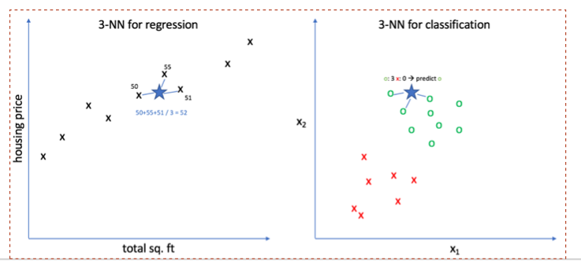
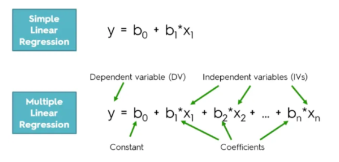
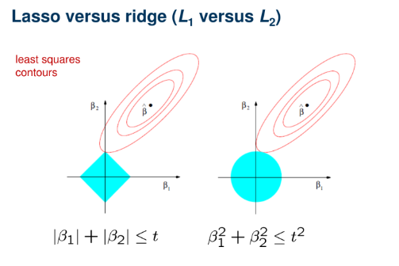
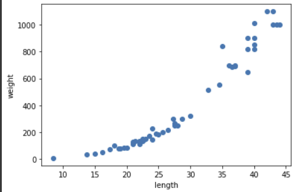
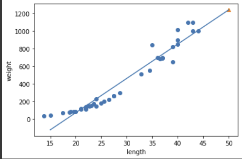
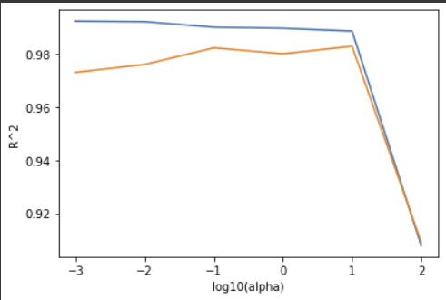

# Notation

## K-최근접 이웃 회귀

- k-최근접 이웃 회귀 알고리즘은 가장 가까운 n 개의 이웃을 선택, 확률을 계산하여 새로운 데이터 특성을 예측하는 방식이다.
- 계산 과정이 간단하지만 기존 데이터 범위를 넘어서는 경우 정확도가 매우 떨어진다.


<br/>
<br/></br>
## 선형 회귀

- 선형 회귀란 y = ax + b 와 같은 선형 방정식 형태로 표현. a 를 coefficient 라고 하고 b를 weight 라고 한다.
-  다항 회귀란, y를 x에 대한 다항식으로 표현하여 모델링하는 것을 말한다. n차 방정식과 동일.
<br/>
<br/></br>
## 다중 회귀

- 다중 회귀란 목표 변수 y를 여러 개의 독립된 변수 a,b,c ... 들의 관계로 나타내는 알고리즘이다.
- 다항 회귀는 독립변수 x의 차수가 n으로 높아진 것이며 다중 회귀는 이와 달리 서로 다른 독립 변수 a,b,c... 가 존재한다.


<br/>
<br/></br>
## Overfitting vs. Underfitting

- overfitting : 어떤 모델이 훈련 데이터의 성질에 너무 깊게 학습되어 훈련 데이터에 대한 예측 성능은 매우 높지만 새로운 데이터에 대해서 score 가 매우 떨어지는 현상.

- underfitting : 훈련 데이터의 특성이 충분히 학습되지 않아 성능이 떨어지는 현상.
- <br/>
<br/></br>
## 규제(릿지&라쏘)

- 오버피팅을 막기 위해 모델이 과도하게 학습되는 것을 규제를 통해 조절.
- 계수를 제곱한 기준으로 규제를 가한 모델을 릿지, 절댓값을 기준으로 하면 라쏘 라고 한다. 
<br/></br>

<br/>
<br/>
<br/></br>

# 혼공머신 K-최근접 회귀 문제

목표 : 농어 길이 데이터를 바탕으로 무게를 추론하는 회귀 모델을 학습.
<br/></br>
## 산점도로 데이터 살펴 보기

(미리 준비된 'perch_length', 'perch_weight' 데이터 이용.)


<br/>
<br/></br>
## train data & test data 분리

```python
from sklearn.model_selection import train_test_split
train_input, test_input, train_target, test_target = train_test_split(
    perch_length, perch_weight, random_state=42
)

# column vector 로 input 데이터 조정.
train_input = train_input.reshape(-1,1)
test_input = test_input.reshape(-1,1)
```
<br/></br>
## k-최근접 이웃 회귀 모델 훈련

```python
from sklearn.neighbors import KNeighborsRregressor
knr = KNeighborsRegressor()
knr.fit(train_input, train_target)      # 모델 훈련

# 모델을 결정계수로 평가.
print(knr.score(test_input, test_target))

>>> 0.992809406101064

# 이웃의 개수를 3으로 설정해서 모델을 조금 더 예민하게 조정.
knr.fit(train_input, train_target)
print(knr.score(train_input, train_target))
print(knr.score(test_input, test_target))

>>> 0.9804899950518966
>>> 0.9746459963987609
```
<br/></br>
## 선형 회귀 문제

- k-최근접 이웃 회귀 모델로 예측하기 어려운 새로운 데이터를 사용할 수 있도록 선형 회귀 모델 사용.
```python
# 기존 데이터에 없는 50cm 농어 데이터, 100cm 농어 데이터
knr.predict([[50]])

>>> array([1033.33333333])

knr.predict([[100]])

>>> array([1033.33333333])
```
이웃 샘플이 동일 하기 때문에 같은 값으로 예측이 되는 문제 발생. 이런 문제를 선형 회귀를 통해 해결.
<br/>
<br/></br>
## 선형 회귀 모델 
```python
from sklearn.linear_model import LinearRegression
lr = LinearRegression()

# 선형 회귀 모델을 훈련합니다.
lr.fit(train_input, train_target)

# 15에서 50까지 1차 방정식 그래프를 그립니다.
plt.plot([15,50], [15*lr.coef_ + lr.intercept_, 50*lr.coef_ + lr.intercept_])

# 훈련 세트의 산점도를 그립니다.
plt.scatter(train_input, train_target)

# 50cm 농어 데이터를 따로 표시합니다.
plt.scatter(50, lr.predict([[50]]), marker='^')
plt.xlabel('length')
plt.ylabel('weight')
plt.show()
```


```python
# 훈련 점수와 테스트 점수 비교
print(lr.score(train_input, train_target))
print(lr.score(test_input, test_target))

>>> 0.939846333997604
>>> 0.8247503123313558
```

모델이 train data에 과도하게 학습되었음을 알 수 있다. overfitting 발생.

```python
# 기존 데이터를 제곱한 값을 특성으로 추가.
train_poly = np.column_stack((train_input ** 2, train_input))   
test_poly = np.column_stack((test_input ** 2, test_input))

# 모델 훈련
lr = LinearRegression()
lr.fit(train_poly, train_target)

# train score, test score 재확인
print(lr.score(train_poly, train_target))
print(lr.score(test_poly, test_target))

>>> 0.9706807451768623
>>> 0.9775935108325122
```
train score 와 test score 를 비교했을 때 이전 모델과는 다르게 overfitting 발생을 방지.
<br/>
<br/></br>
# 특성 공학과 규제

목표
- 사이킷런의 다양한 도구를 활용하여 여러 특성을 사용한 다중 회귀 모델 구현
- 복잡한 모델의 과대적합을 막기 위해 릿지와 라쏘 회귀 사용.
<br/></br>
## 데이터 준비

앞서 사용했던 데이터에 특성이 하나 더 추가 된 'perch_full' 데이터 사용.
```python
import pandas as pd
df = pd.read_csv('https://bit.ly/perch_csv_data')
perch_full = df.to_numpy()  # 판다스 -> 넘파이 배열
```

```python
train_input, test_input, train_target, test_target = train_test_split(
    perch_full, perch_weight, random_state=42)
```
<br/></br>
## PolynomialFeatures 클래스

PolynomialFeatures 클래스의 경우, 입력한 특성 관련해서 (특성)^2, (특성1)*(특성2) 같은 새로운 특성들을 계산하여 제공한다.

train_input 데이터를 해당 클래스에 통과시키면 다음과 같은 결과를 보인다.

```python
from sklearn.preprocessing import PolynomialFeatures
poly = PolynomialFeatures(include_bias=False)

poly.fit(train_input)
train_poly = poly.transform(train_input)

print(train_poly.shape)
print(poly.get_feature_names())

>>> (42, 9)     # 9개의 특성.
>>> ['x0', 'x1', 'x2', 'x0^2', 'x0 x1', 'x0 x2', 'x1^2', 'x1 x2', 'x2^2']
```
위의 train_poly 데이터를 사용해 선형 회귀 모델을 훈련시켜 본다.

```python
lr = LinearRegression()
lr.fit(train_poly, train_target)

print(lr.score(train_poly, train_target))
print(lr.score(test_poly, test_target))

>>> 0.9903183436982124
>>> 0.9714559911594134
```
여전히 overfitting 현상이 남아 있다.

특성의 개수를 추가시켜서 모델을 학습시켜 보자.

```python
# PolynomialFeatures 클래스의 degree 파라미터를 변경하여 특성의 개수를 추가합니다.
poly = PolynomialFeatures(degree=5, include_bias=False)
poly.fit(train_input)
train_poly = poly.transform(train_input)
test_poly = poly.transform(test_input)

# 모델 훈련 및 score 평가
lr.fit(train_poly, train_target)
print(lr.score(train_poly, train_target))
print(lr.score(test_poly, test_target))

>>> 0.9999999999938143
>>> -144.40744532797535
```
오히려 훈련 세트에 대해 너무 과대적합되므로 테스트 데이터에 대한 점수가 굉장히 낮게 나온다.
<br/>
<br/></br>
## 규제

각 특성을 정규화한 후 규제를 적용해보자.
<br/></br>
### 릿지 회귀
```python
from sklearn.preprocessing import StandardScaler
ss = StandardScaler()
ss.fit(train_poly)

train_scaled = ss.transform(train_poly)
test_scaled = ss.transform(test_poly)

# 각 계수를 제곱한 값을 바탕으로 규제를 적용하는 릿지 회귀를 사용합니다.
from sklearn.linear_model import Ridge
ridge = Ridge()

ridge.fit(train_scaled, train_target)
print(ridge.score(train_scaled, train_target))
print(ridge.score(test_scaled, test_target))

>>> 0.9896101671037343
>>> 0.979069397761539
```
score 사이 간의 차이가 줄어들었다. 최적의 규제깂을 확인해보자.
```python
train_score = []
test_score = []

alpha_list = [0.001, 0.01, 0.1, 1, 10, 100]
for alpha in alpha_list:
    # 릿지 모델을 만듭니다.
    ridge = Ridge(alpha = alpha)
    # 릿지 모델을 훈련합니다.
    ridge.fit(train_scaled, train_target)
    # 훈련 점수와 테스트 점수를 저정합니다.
    train_score.append(ridge.score(train_scaled, train_target))
    test_score.append(ridge.score(test_scaled, test_target))

plt.plot(np.log10(alpha_list), train_score)
plt.plot(np.log10(alpha_list), test_score)
plt.xlabel('log10(alpha)')     #로그 스케일
plt.ylabel('R^2')
plt.show()    
```


alpha = 0.1일 때 결정계수가 가장 큰 값을 보인다.

```python
# alpha=0.1을 사용하여 최종 학습 후 평가를 해 봅니다.
ridge = Ridge(alpha=0.1)
ridge.fit(train_scaled, train_target)

print(ridge.score(train_scaled, train_target))
print(ridge.score(test_scaled, test_target))

>>> 0.9903815817570368
>>> 0.9827976465386954
```
<br/></br>
### 라쏘 회귀

```python
# 각 계수의 절대값을 바탕으로 규제를 적용하는 라쏘 회귀를 사용합니다.
from sklearn.linear_model import Lasso
lasso = Lasso()
lasso.fit(train_scaled, train_target)

print(lasso.score(train_scaled, train_target))
print(lasso.score(test_scaled, test_target))

>>> 0.989789897208096
>>> 0.9800593698421884
```
alpha 조정을 통해 라쏘 회귀 역시 규제를 조절할 수 있다. 라쏘 회귀 역시 릿지 회귀에서와 동일한 과정을 거쳐 alpha 값에 따른 결정계수 그래프를 그려보면 다음과 같으며, 적절한 alpha 값을 찾을 수 있다.



```python
# 그래프에서 보이는 최적의 alpha 값 10을 적용해보자.
lasso = Lasso(alpha=10)
lasso.fit(train_scaled, train_target)

print(lasso.score(train_scaled, train_target))
print(lasso.score(test_scaled, test_target))

>>> 0.9888067471131867
>>> 0.9824470598706695
```

두 score 사이의 차이가 줄어들었다. overfitting을 어느 정도 조절하게 되었다.
<br/></br>
## 라쏘 회귀의 또다른 기능
```python
print(np.sum(lasso.coef_ == 0))
>>> 40
```
라쏘 회귀는 절댓값을 사용하기 때문에 특정 계수를 0으로 만들 수 있다. 위의 코드 결과는 훈련과정에서 0이 된 파라미터의 개수가 40개 임을 확인할 수 있다. 

55개의 특성 중 40개가 0이고 나머지 15개 weights 만이 실질적으로 사용되며 이러한 특징은 라쏘 모델을 유용한 특성을 골라내는 용도로도 사용할 수 있음을 보여준다.