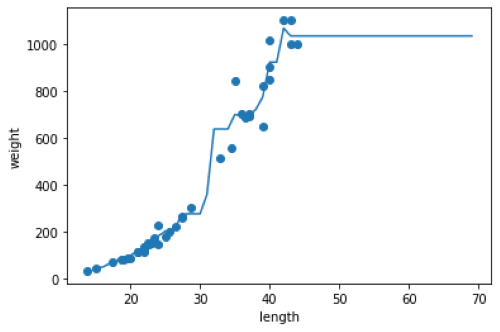
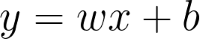

# 🖥️ 혼공머신 스터디 : 3장 요약
#### 스터디 3조 이재흠 (@rethinking21, rethinking21@gmail.com)

***
## 챕터 3 회귀 알고리즘과 모델 규제 🐠🐟

### 03-1. k-최근접 이웃 회귀 🎯

###### * 분류와 회귀
**분류(classification)** 는 미리 정의된 여러 클래스 레이블중 하나를 예측하는 과정입니다. 
지난 2챕터에서는 분류에 대해서 설명을 했으며, 이중 분류와 다중 분류에 대해서도 설명을 했습니다.
<br><br>이와 달리, **회귀(regression)** 는 연속적인 숫자를 예측하는 과정입니다. 분류에서는 몇개의 정해진 클래스중 하나를 선택하여 결정을 하도록 짜여져 있지만,
회귀는 대푯값이 클래스가 아니며, **연속성**을 띤 출력값을 지니게 됩니다.

일반적으로 얻고자 하는 데이터의 값이 이름(ex. 생성종류, 이름)일 경우 분류를 이용하고, 데이터의 값이 숫자(키, 나이)일 경우 회귀를 사용합니다.

###### * k-최근접 이웃 회귀 (k-NN Regression)


<br>▲ k-최근접 이웃 회귀에 작동방식([🖼️ 이미지 출처][1])] 
<br> 기존에 배운 k-최근접 이웃(k-NN, K-Nearest Neighbor)이 근처에 있는 k개의 데이터를 보고 속할 **그룹**을 판단해주는 알고리즘이었습니다.
이와 달리 **k-최근접 이웃 회귀 (k-NN Regression)** 는 근처에 있는 k개의 데이터를 보고 그 값들의 **평균**을 반환하는 알고리즘입니다.

<br>scikit-learn에 있는 클래스 KNeighborsRegressor를 이용해 k-최근접 이웃 회귀를 구현 할 수 있습니다.

```python
from sklearn.neighbors import KNeighborsRegressor

knr = KNeighborsRegressor()
knr.fit(train_input, train_target) #학습
```

###### * reshape()
학습이나 훈련을 할때 1차원으로 나열되어있던 배열을 2차원으로 바꿔야 하는 상황이 생깁니다.
이때 numpy 안에 있는 **reshpae()** 메서드를 이용해 바꾸려는 배열의 크기를 지정할 수 있습니다.

```python
import numpy as np

test_array = np.array([1,2,3,4])
print(test_array.shape)  # (4,)
test_array = test_array.reshape(2,2) #배열의 크기를 바꾸어줍니다.
print(test_array.shape) #(2,2)
```

크기에 -1을 지정할 경우, 나머지 원소로 배열이 알아서 지정됩니다.
```python
import numpy as np

print(test_array.shape) #(1000,)
test_array = test_array.reshape(-1,1) #2차원 배열의 크기가 1인 상태로 고정되어 원소가 채워집니다.
print(test_array.shape) #(1,1000)
```

######  * 결정계수 (R<sup>2</sup>)

분류의 경우, 예측한 값들이 실제 값과 맞는지 안맞는지만 판단하면 되기에 모델을 평가하는데 무리가 없었습니다. 
하지만 회귀는 값을 연속적인 값을 가지고 있어 정확한 숫자를 맞힌다는 것은 거의 불가능합니다.
이 경우 우리는 다른 평가방식을 택하는데, 그 중 **결정계수(coefficient of determination, R<sup>2</sup>)** 는 회귀에서 모델을 평가하는데 많이 쓰이는 평가방식중 하나입니다.

<br> R<sup>2</sup>를 구하는 방법은 다음과 같습니다.


<br>여기서 SSE는 회귀선에 위치한 값(추정 값)과 실제값의 차이(오차)의 제곱이며, SST는 실제 값 과 Y의 평균을 뺀 값의 제곱을 의미합니다.

<br>R<sup>2</sup>는 회귀모형 내에서 설명변수 x로 설명할 수 있는 반응변수 y의 변동 비율입니다.
<br>[❕ R<sup>2</sup>결정계수에 대한 더 자세한 설명][2]
<br>scikit-learn에 있는 클래스 r2_score를 이용해 패키지를 통해 쉽게 사용할 수 있습니다.
```python
from sklearn.metrics import r2_score

test_prediction = model.predict(test_input)
r2_score(test_target, test_prediction) #결정계수
```
<br>

###### * MAE(mean absolute error)


**MAE(mean absolute error)** 는 모든 절대 오차의 평균입니다.
<br>scikit-learn에 있는 클래스 mean_absolute_error 패키지를 통해 쉽게 사용할 수 있습니다.
```python
from sklearn.metrics import mean_absolute_error

test_prediction = model.predict(test_input)
mae = mean_absolute_error(test_target, test_prediction) #MAE
print(mae)
```

###### * 과대적합 vs 과소적합 

<br>
▲ 과대적합, 과소적합에 대한 설명 이미지([🖼️ 이미지 출처][3])] 

훈련세트에서 점수가 높게 나왔지만, 테스트 세트에서 점수가 매우 안좋게 나왔다면 모델이 훈련세트에 **과대적합(overfitting)** 되었다고 말합니다.
<br>반면, 훈련세트와 테스트 세트가 동시에 낮거나 테스트 세트의 점수가 오히려 더 높은 경우, 모델이 훈련세트에 **과소적합(underfitting)** 되었다고 말합니다.

### 03-2. 선형 회귀 🎢
###### * k-최근접 이웃 회귀 (k-NN Regression)의 한계

k-최근접 이웃 회귀 알고리즘은 직관적이며, 간단하기에 처음 머신러닝을 시작하기에 편리하지만, **데이터 밖의 범위**의 새로운 데이터에서는 예측이 불가능하다는 단점이 있습니다.
<br>이해하기 쉽게 표를 이용하여 설명해봅시다.
<br><br>
위 그래프는 훈련 데이터(점)에 따른 테스트 결과값(선)의 그래프입니다. 5~45 정도 까지는 어느정도 예측을 했지만, 50이상부터는 일직선으로 나와버리는 현상이 일어납니다. 
이는 알고리즘이 데이터에서 멀어질 때에도 k개의 '근처'에 있는 데이터를 보고 판단하기 때문에 생기는 현상입니다.

###### * 선형 회귀 (linear regression)
**선형회귀(linear regression)** 는 종속 변수 y와 여러 개의 독립 변수 x와의 선형 관계를 모델링하는 회귀분석 기법입니다.
그중에 변수 x가 하나일 때를 **단순 선형 회귀(Simple Linear Regression)** 이라 부르기도 합니다.
<br><br>
k-NN 회귀(주황색)과 달리 선형 회귀(파란색)은 주어진 훈련 데이터 범위 밖을 지나는 데이터도 예측이 가능하다는 특징이 있습니다.
또한 훈련하는 속도가 빠르고 결과값을 내는데 시간이 좀 걸리는 k-nn과 달리, 선형회귀는 훈련 속도는 다소 느리지만(그래도 빠르긴 하다) 테스트 속도가 빠르다는 장점을 지니고 있습니다.

이때 하나의 선형함수는 다음과 같이 표현할 수 있습니다.
<br><br>
이때 w를 **가중치(weight)** , 별도로 더해지는 값 b를 **편향(bias)** 이라고 부릅니다.

scikit-learn에서는 LinearRegression모델로 간편하게 선형회귀 모델을 만들 수 있습니다.
```python
from sklearn.linear_model import LinearRegression
lr = LinearRegression()

lr.fit(train_input, train_target)
print(lr.predict([[50]]))
print(lr.coef_) #학습된 선형함수의 계수(또는 가중치)를 불러옵니다. 이는 한개 일 수도 있고, 여러개 일 수도 있습니다.
print(lr.intercept_) #학습된 선형함수의 편향을 불러옵니다.
```

선형회귀의 학습과정 중에는 경사하강법(Gradient Descent)이 나오긴 하지만, 이는 다른 챕터에서 다룰 예정입니다.
<br>[❕ 선형회귀와 다중회귀& 경사하강법에 대한 간단한 설명(링크)][4]

###### * 다항 회귀 (polynomial regression)
**다항 회귀(polynomial regression)** 는 다항식을 이용한 선형 회귀로, 항이 2차, 3차, 제곱근일수도 있으며(로그함수 일 수도 있습니다!), 함수의 형태가 **비선형**이라는 특징이 있습니다.
<br><br>

### 03-3. 특성 공학과 규제

###### * 다중 회귀 (multiple regression, Multiple Linear Regression)
여러개의 특성을 활용한 선형 회귀를 **다중 회귀(multiple regression, Multiple Linear Regression)** 라고 부릅니다.
단순 선형 회귀와 달리 다중 회귀는 여러개의 특성을 사용한다는 차이점이 있습니다.
<br><br>

다중 회귀에 사용되는 특성들 중에는 특성을 제곱한다던지 특성을 서로 곱하여 새로운 특성을 만드는 경우가 있습니다. 이처럼 기존의 특성을 이용하여 새로운 특성을 만들어 내는 작업을  **특성 공학(feature engineering)** 이라고 부릅니다.
###### * 판다스(Pandas)와 사이킷런 변환기, 정규화 클래스
**판다스(Pandas)** 는 파이썬의 유명한 데이터 분석 라이브러리입니다. 이중 **데이터프레임(dataframe)** 은 판다스의 핵심 데이터 구조입니다. 판다스를 이용해 .csv파일을 numpy 배열로 바꿀수도 있고, 웹사이트에 있는 데이터 구조를 불러올 수 있습니다.
```python
import pandas as pd
df = pd.read_csv('website') #웹사이트에 있는 csv파일을 불러옵니다.
perch_full = df.to_numpy() #데이터를 numpy 배열로 바꿔줍니다.
```

Scikit-learn에서는 특성을 새로 만들거나 전처리를 하기 위해 다양한 클래스를 제공하며, 이를 **변환기(transformer)** 라고 부릅니다.
```python
from sklearn.preprocessing import PolynomialFeatures

poly = PolynomialFeatures(degree=4 ,include_bias=False) #degree = 몇차수까지를 특성으로 만들건지 결정합니다.
poly.fit([[2,3]])
print(poly.transform([[2,3]])) #[[2. 3. 4. 6. 9.]]

```

또한 Scikit-learn에서는 StandardScaler클래스를 통해 정규화를 쉽게 할 수 있습니다.
```python
from sklearn.preprocessing import StandardScaler
ss = StandardScaler()
ss.fit(train_data) # 정규화를 하기 위해 먼저 테스트 데이터를 넣습니다.
train_scald = ss.transform(train_data) # 구한 값을 이용해 정규화를 진행합니다.
test_scaled = ss.transform(test_poly) # 주의해야 할 것은 테스트 데이터를 '훈련'데이터로 정규화해야 한다는 것입니다.
```

###### * 규제(Regularization)
**규제(Regularization)** 는 머신러닝 모델의 과대적합 문제를 피하기 위해서 너무 과도하게 학습하지 못하도록 만드는 것을 말합니다.
선형 회귀 모델의 경우, 각 특성의 가중치의 크기를 작게 만들어 규제를 할 수 있습니다.

###### * 릿지 회귀(Ridge Regression, L2 Regression) 

```python
from sklearn.linear_model import Ridge
ridge = Ridge(alpha=0.1) #알파값을 통해 언제가 가장 최적의 값이 되는지 찾아야 합니다.
ridge.fit(train_scaled, train_target)
ridge.score(test_scaled,test_target)
```

###### * 라쏘 회귀(Lasso Regression, L1 Regression)

```python
from sklearn.linear_model import Lasso
lasso = Lasso(alpha=10) #알파값을 통해 언제가 가장 최적의 값이 되는지 찾아야 합니다.
lasso.fit(train_scaled, train_target)
lasso.score(test_scaled,test_target)
```

#### * 아직 규제쪽은 이해를 못했어요..🥺
[1]: https://tensorflow.blog/파이썬-머신러닝/2-3-2-k-최근접-이웃/
[2]: https://datalabbit.tistory.com/54
[3]: https://towardsdatascience.com/overfitting-vs-underfitting-a-conceptual-explanation-d94ee20ca7f9
[4]: https://wikidocs.net/21670