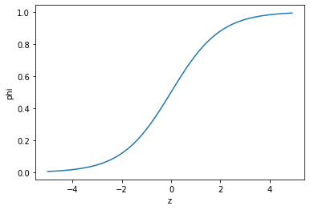
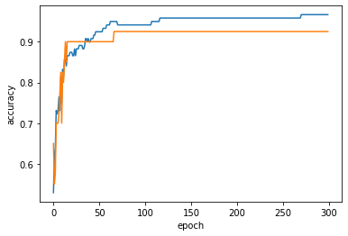

# 2022년 3월 31일 HAI 혼공머신 스터디 1조 발표
### 발표자: 송종명

## __Contents__
### Chapter 4
- 로지스틱 회귀
- 로지스틱 회귀를 이용한 다중분류
- 시그모이드 함수
- 소프트맥스 함수
- 경사 하강법

<hr>

## Chapter 4
### 로지스틱 회귀
- 로지스틱 회귀는 선형 방정식을 활용해 학습하는 분류 모델입니다.
- 학습된 데이터를 바탕으로 새로운 데이터가 목표하는 클래스에 속하는지 아닌지를 시그모이드(sigmoid)함수를 활용하여 0~1 사이의 확률로 나타냅니다.

### 로지스틱 회귀를 이용한 다중분류
- 로지스틱 회귀는 이진 분류 문제를 해결할 때 성능이 가장 좋습니다.
- 그래서 다중 분류 문제를 해결하기 위해서 이진 분류를 여러 번 하는 방식으로 계산합니다.
- 다중분류일 때의 예측 결과는 단순 확률로 나타내기 어려우므로 확률분포를 만들어내는 소프트맥스 함수를 사용합니다.

### 시그모이드 함수
- 시그모이드 함수는 로짓(logit) 함수의 역함수입니다.
- 로짓 함수는 두 확률의 확률비(odds)에 로그를 취한 함수를 말합니다.

### 소프트맥스 함수
- 소프트맥스 함수는 시그모이드 함수를 바이너리가 아닌 N에 대해서 확장한 함수입니다.
- odds 함수를 클래스 개수가 K개일때로 일반화 한 뒤 양 변을 i=1 부터 i=k-1 까지 더하고 이 식을 P(Ck|X)에 대해 정리하면 소프트맥스 함수를 얻을 수 있습니다.
- 소프트맥스 함수는 N개의 클래스에 속할 확률들을 나타내는 확률분포를 만들게 됩니다.

### 경사 하강법
- 경사 하강법은 각 파라미터들의 적절한 가중치를 찾기 위한 최적화 알고리즘입니다.
- Z = A * x + B * y + C * z + D 라고 가정했을 때 파라미터 x, y, z 에 대한 가중치 A, B, C, D를 바꾸어가며 경사가 0이 되는 부분을 찾는 알고리즘입니다.
- 이때 파라미터를 한 개만 사용할 경우 확률적 경사 하강법, 모든 X에 대해서 경사의 평균을 구하면 배치 경사 하강법, N개의 파라미터에 대해 평균을 내면 미니 배치 경사 하강법이라고 합니다.


### __아래는 이번주 발표자분이 작성한 프로그램 실행 과정입니다.__


<br>

# 로지스틱 회귀

## 럭키백의 확률

### 데이터 준비하기


```python
import pandas as pd

fish = pd.read_csv('https://bit.ly/fish_csv_data')
fish.head()
```


<div>
<style scoped>
    .dataframe tbody tr th:only-of-type {
        vertical-align: middle;
    }

    .dataframe tbody tr th {
        vertical-align: top;
    }

    .dataframe thead th {
        text-align: right;
    }
</style>
<table border="1" class="dataframe">
  <thead>
    <tr style="text-align: right;">
      <th></th>
      <th>Species</th>
      <th>Weight</th>
      <th>Length</th>
      <th>Diagonal</th>
      <th>Height</th>
      <th>Width</th>
    </tr>
  </thead>
  <tbody>
    <tr>
      <th>0</th>
      <td>Bream</td>
      <td>242.0</td>
      <td>25.4</td>
      <td>30.0</td>
      <td>11.5200</td>
      <td>4.0200</td>
    </tr>
    <tr>
      <th>1</th>
      <td>Bream</td>
      <td>290.0</td>
      <td>26.3</td>
      <td>31.2</td>
      <td>12.4800</td>
      <td>4.3056</td>
    </tr>
    <tr>
      <th>2</th>
      <td>Bream</td>
      <td>340.0</td>
      <td>26.5</td>
      <td>31.1</td>
      <td>12.3778</td>
      <td>4.6961</td>
    </tr>
    <tr>
      <th>3</th>
      <td>Bream</td>
      <td>363.0</td>
      <td>29.0</td>
      <td>33.5</td>
      <td>12.7300</td>
      <td>4.4555</td>
    </tr>
    <tr>
      <th>4</th>
      <td>Bream</td>
      <td>430.0</td>
      <td>29.0</td>
      <td>34.0</td>
      <td>12.4440</td>
      <td>5.1340</td>
    </tr>
  </tbody>
</table>
</div>


```python
print(pd.unique(fish['Species']))
```

    ['Bream' 'Roach' 'Whitefish' 'Parkki' 'Perch' 'Pike' 'Smelt']
    


```python
fish_input = fish[['Weight','Length','Diagonal','Height','Width']].to_numpy()
```


```python
print(fish_input[:5])
```

    [[242.      25.4     30.      11.52     4.02  ]
     [290.      26.3     31.2     12.48     4.3056]
     [340.      26.5     31.1     12.3778   4.6961]
     [363.      29.      33.5     12.73     4.4555]
     [430.      29.      34.      12.444    5.134 ]]
    


```python
fish_target = fish['Species'].to_numpy()
```


```python
from sklearn.model_selection import train_test_split

train_input, test_input, train_target, test_target = train_test_split(
    fish_input, fish_target, random_state=42)
```


```python
from sklearn.preprocessing import StandardScaler

ss = StandardScaler()
ss.fit(train_input)
train_scaled = ss.transform(train_input)
test_scaled = ss.transform(test_input)
```

### k-최근접 이웃 분류기의 확률 예측


```python
from sklearn.neighbors import KNeighborsClassifier

kn = KNeighborsClassifier(n_neighbors=3)
kn.fit(train_scaled, train_target)

print(kn.score(train_scaled, train_target))
print(kn.score(test_scaled, test_target))
```

    0.8907563025210085
    0.85
    


```python
print(kn.classes_)
```

    ['Bream' 'Parkki' 'Perch' 'Pike' 'Roach' 'Smelt' 'Whitefish']
    


```python
print(kn.predict(test_scaled[:5]))
```

    ['Perch' 'Smelt' 'Pike' 'Perch' 'Perch']
    


```python
import numpy as np

proba = kn.predict_proba(test_scaled[:5])
print(np.round(proba, decimals=4))
```

    [[0.     0.     1.     0.     0.     0.     0.    ]
     [0.     0.     0.     0.     0.     1.     0.    ]
     [0.     0.     0.     1.     0.     0.     0.    ]
     [0.     0.     0.6667 0.     0.3333 0.     0.    ]
     [0.     0.     0.6667 0.     0.3333 0.     0.    ]]
    


```python
distances, indexes = kn.kneighbors(test_scaled[3:4])
print(train_target[indexes])
```

    [['Roach' 'Perch' 'Perch']]
    

## 로지스틱 회귀


```python
import numpy as np
import matplotlib.pyplot as plt

z = np.arange(-5, 5, 0.1)
phi = 1 / (1 + np.exp(-z))

plt.plot(z, phi)
plt.xlabel('z')
plt.ylabel('phi')
plt.show()
```


    

    


### 로지스틱 회귀로 이진 분류 수행하기


```python
char_arr = np.array(['A', 'B', 'C', 'D', 'E'])
print(char_arr[[True, False, True, False, False]])
```

    ['A' 'C']
    


```python
bream_smelt_indexes = (train_target == 'Bream') | (train_target == 'Smelt')
train_bream_smelt = train_scaled[bream_smelt_indexes]
target_bream_smelt = train_target[bream_smelt_indexes]
```


```python
from sklearn.linear_model import LogisticRegression

lr = LogisticRegression()
lr.fit(train_bream_smelt, target_bream_smelt)
```


    LogisticRegression()


```python
print(lr.predict(train_bream_smelt[:5]))
```

    ['Bream' 'Smelt' 'Bream' 'Bream' 'Bream']
    


```python
print(lr.predict_proba(train_bream_smelt[:5]))
```

    [[0.99759855 0.00240145]
     [0.02735183 0.97264817]
     [0.99486072 0.00513928]
     [0.98584202 0.01415798]
     [0.99767269 0.00232731]]
    


```python
print(lr.classes_)
```

    ['Bream' 'Smelt']
    


```python
print(lr.coef_, lr.intercept_)
```

    [[-0.4037798  -0.57620209 -0.66280298 -1.01290277 -0.73168947]] [-2.16155132]
    


```python
decisions = lr.decision_function(train_bream_smelt[:5])
print(decisions)
```

    [-6.02927744  3.57123907 -5.26568906 -4.24321775 -6.0607117 ]
    


```python
from scipy.special import expit

print(expit(decisions))
```

    [0.00240145 0.97264817 0.00513928 0.01415798 0.00232731]
    

### 로지스틱 회귀로 다중 분류 수행하기


```python
lr = LogisticRegression(C=20, max_iter=1000)
lr.fit(train_scaled, train_target)

print(lr.score(train_scaled, train_target))
print(lr.score(test_scaled, test_target))
```

    0.9327731092436975
    0.925
    


```python
print(lr.predict(test_scaled[:5]))
```

    ['Perch' 'Smelt' 'Pike' 'Roach' 'Perch']
    


```python
proba = lr.predict_proba(test_scaled[:5])
print(np.round(proba, decimals=3))
```

    [[0.    0.014 0.841 0.    0.136 0.007 0.003]
     [0.    0.003 0.044 0.    0.007 0.946 0.   ]
     [0.    0.    0.034 0.935 0.015 0.016 0.   ]
     [0.011 0.034 0.306 0.007 0.567 0.    0.076]
     [0.    0.    0.904 0.002 0.089 0.002 0.001]]
    


```python
print(lr.classes_)
```

    ['Bream' 'Parkki' 'Perch' 'Pike' 'Roach' 'Smelt' 'Whitefish']
    


```python
print(lr.coef_.shape, lr.intercept_.shape)
```

    (7, 5) (7,)
    


```python
decision = lr.decision_function(test_scaled[:5])
print(np.round(decision, decimals=2))
```

    [[ -6.5    1.03   5.16  -2.73   3.34   0.33  -0.63]
     [-10.86   1.93   4.77  -2.4    2.98   7.84  -4.26]
     [ -4.34  -6.23   3.17   6.49   2.36   2.42  -3.87]
     [ -0.68   0.45   2.65  -1.19   3.26  -5.75   1.26]
     [ -6.4   -1.99   5.82  -0.11   3.5   -0.11  -0.71]]
    


```python
from scipy.special import softmax

proba = softmax(decision, axis=1)
print(np.round(proba, decimals=3))
```

    [[0.    0.014 0.841 0.    0.136 0.007 0.003]
     [0.    0.003 0.044 0.    0.007 0.946 0.   ]
     [0.    0.    0.034 0.935 0.015 0.016 0.   ]
     [0.011 0.034 0.306 0.007 0.567 0.    0.076]
     [0.    0.    0.904 0.002 0.089 0.002 0.001]]
    
<br>

# 확률적 경사 하강법

## SGDClassifier


```python
import pandas as pd

fish = pd.read_csv('https://bit.ly/fish_csv_data')
```


```python
fish_input = fish[['Weight','Length','Diagonal','Height','Width']].to_numpy()
fish_target = fish['Species'].to_numpy()
```


```python
from sklearn.model_selection import train_test_split

train_input, test_input, train_target, test_target = train_test_split(
    fish_input, fish_target, random_state=42)
```


```python
from sklearn.preprocessing import StandardScaler

ss = StandardScaler()
ss.fit(train_input)
train_scaled = ss.transform(train_input)
test_scaled = ss.transform(test_input)
```


```python
from sklearn.linear_model import SGDClassifier
```


```python
sc = SGDClassifier(loss='log', max_iter=10, random_state=42)
sc.fit(train_scaled, train_target)

print(sc.score(train_scaled, train_target))
print(sc.score(test_scaled, test_target))
```

    0.773109243697479
    0.775
    

    /mnt/disks/sdb/github/hg-mldl/.env/lib/python3.7/site-packages/sklearn/linear_model/_stochastic_gradient.py:700: ConvergenceWarning: Maximum number of iteration reached before convergence. Consider increasing max_iter to improve the fit.
      ConvergenceWarning,
    


```python
sc.partial_fit(train_scaled, train_target)

print(sc.score(train_scaled, train_target))
print(sc.score(test_scaled, test_target))
```

    0.8151260504201681
    0.85
    

## 에포크와 과대/과소적합


```python
import numpy as np

sc = SGDClassifier(loss='log', random_state=42)

train_score = []
test_score = []

classes = np.unique(train_target)
```


```python
for _ in range(0, 300):
    sc.partial_fit(train_scaled, train_target, classes=classes)
    
    train_score.append(sc.score(train_scaled, train_target))
    test_score.append(sc.score(test_scaled, test_target))
```


```python
import matplotlib.pyplot as plt

plt.plot(train_score)
plt.plot(test_score)
plt.xlabel('epoch')
plt.ylabel('accuracy')
plt.show()
```


    

    


```python
sc = SGDClassifier(loss='log', max_iter=100, tol=None, random_state=42)
sc.fit(train_scaled, train_target)

print(sc.score(train_scaled, train_target))
print(sc.score(test_scaled, test_target))
```

    0.957983193277311
    0.925
    


```python
sc = SGDClassifier(loss='hinge', max_iter=100, tol=None, random_state=42)
sc.fit(train_scaled, train_target)

print(sc.score(train_scaled, train_target))
print(sc.score(test_scaled, test_target))
```

    0.9495798319327731
    0.925
    

