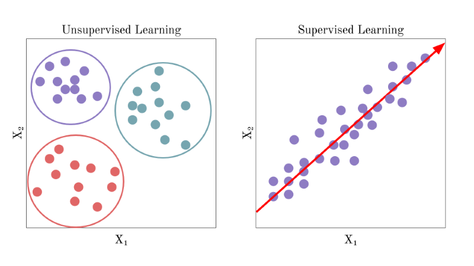
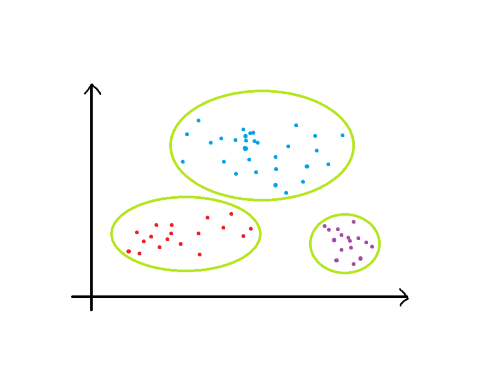
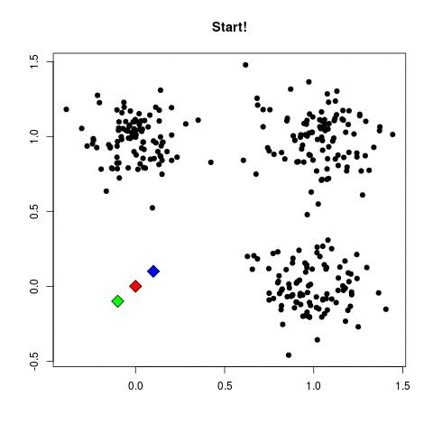
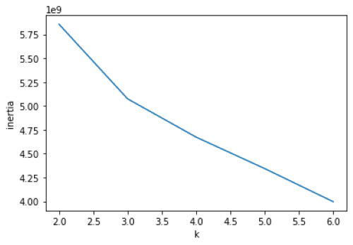
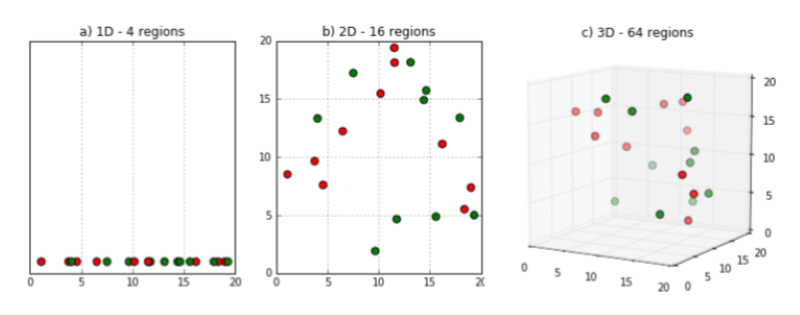
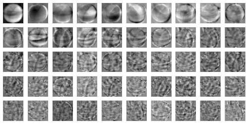

# 🖥️ 혼공머신 스터디 : 6장 요약
#### 스터디 4조 (new) 이재흠 (@rethinking21, rethinking21@gmail.com)

***
## 챕터 6 비지도 학습🍎🍍🍌<br><br>

### 05-1. 군집 알고리즘 🐝

###### 비지도 학습 (unsupervised learning)


**비지도 학습 (unsupervised learning)** 은 라벨이 없는 기존 데이터를 비슷한 특징끼리 군집화하여 새로운 데이터에 대한 결과를 예측하는 학습입니다.

<br><br>
▲[🖼️ 이미지 출처][06-1_01]<br>

지도 학습의 경우, 데이터에 대한 라벨을 미리 주어 입력한 데이터에 대한 원하는 값이 미리 나와 있어야 합니다.
이와 달리, 비지도 학습은 라벨을 미리 주지 않습니다.
이는 데이터들을 분류하고, 분류한 데이터들의 특성(성격)을 파악하는걸 중점적으로 두기 위함입니다.

<br>[❕ 비지도 학습에 대한 더 자세한 설명][06-1_02]

###### 군집 (clustering) & 클러스터 (cluster)


<br><br>

비슷한 샘플끼리 그룹으로 모으는 작업을 **군집 (clustering)** 이라고 합니다.
군집은 대표적인 비지도 학습 작업중 하나입니다.
군집 알고리즘에서 만든 그룹을 **클러스터 (cluster)** 라고 합니다.

<br>[❕ 군집에 대한 더 깊은 내용][06-1_03]

### 05-2. k-평균 📋

###### k-평균 (k-means)

**k-평균 알고리즘(K-means clustering algorithm)** 은 주어진 데이터를 k개의 클러스터로 묶는 알고리즘입니다.
이 클러스터들의 평균값이 클러스터의 중심에 위치하기 때문에 **클러스터 중심 (cluster center)** 또는 **센트로이드 (centroid)** 라고 부르기도 합니다.

k-평균 알고리즘을 구하는 방식은 다음과 같습니다.

<br><br>

<br>1. 무작위로 k개의 클러스터 중심을 정합니다.
<br>2. 각 샘플에서 가장 가까운 클러스터 중심을 찾아 해당 클러스터 샘플로 지정합니다.
<br>3. 클러스터에 속한 샘플의 평균값으로 클러스터 중심을 변경합니다.
<br>4. 클러스터 중심에 변화가 없을 떄까지 2번으로 돌아가 반복합니다.

Scikit-learn에서는 sklearn.cluster 모듈아래 KMeans 클래스로 k-평균 알고리즘이 구현되어있습니다.
<br>비지도 학습은 fit() 메서드에 타깃 데이터를 필요로 하지 않습니다.

```python
from sklearn.cluster import KMeans

km = KMeans(n_clusters=3, random_state=42) # n_clusters는 클러스터의 개수를 의미합니다.
km.fit(train_data)
```

fit() 메서드를 실행하였을 때 데이터가 어떤 클러스터에 속해 있는지는 다음과 같이 확인 할 수 있습니다.
주의해야 할점은, 훈련 데이터는 2차원 배열(샘플개수, 너비×높이)로 변경해야 한다는 점입니다.
```python

import numpy as np

km.labels__
np.unique(km.labels__, return_counts=True)

train_data[km.labels__==0] # 불리언 인덱싱을 통해 해당 클러스터가 가진 데이터들을 추출할 수 있습니다.
```
이때 나타나는 숫자값(0,1,2...)의 순서는 어떠한 의미도 담겨 있지 않습니다.

<br>k-평균 알고리즘을 통해 최종적으로 얻은 클러스터 중심은 cluster_center 속성에 저장되어 있습니다.

<br>[❕ k-평균 알고리즘에 대한 더 깊은 내용][06-2_01]

###### 최적의 k찾기 : 엘보우 (elbow)

k-평균 알고리즘의 단점 중 하나는 클러스터 개수를 사전에 지정해야 한다는 것 입니다.
적절한 k값을 미리 정해 주어야 하지만, 비지도 학습이기에 실전에서는 몇개의 클러스터가 있는지를 알 수 없습니다.

<br>적절한 클러스터의 개수를 찾기 위한 방법으로는 대표적으로 **엘보우 (elbow)** 방법이 있습니다.

k-평균 알고리즘은 클러스터 중심과 속한 샘플 사이의 거리를 잴 수 있습니다.
이떄 클러스터의 샘플들의 거리들을 합하여 샘플들이 얼마나 가깝게 모여있는지 나타낼 수 있습니다.
이 값을 **이니셔 (inertia)** 라고 부릅니다.
<br>일반적으로 클러스터의 개수가 늘어날수록 클러스터가 포함하고 있는 데이터의 수도 줄기 때문에 이니셔도 줄어듭니다.

<br>엘보우 방법은 클러스터의 개수에 따른 이니셔의 변화를 관찰하여 최적의 클러스터 개수를 찾는 방법입니다.

<br><br>

### 05-3. 주성분 분석 📊

###### 차원과 차원 축소 (dimensionality reduction)

머신러닝에서는 데이터가 가진 속성을 특성이라고 하며, 이를 **차원 (dimension)** 이라고도 부릅니다.
<br>[❕ 머신러닝에서의 차원에 대한 더 자세한 설명][06-3_01]

<br><br>
▲[🖼️ 이미지 출처][06-3_02]<br>
일반적으로, 특성이 더 많을 수록 데이터의 예측은 더 정확해질 것이라 생각합니다.
하지만, 차원이 늘어날 수록 문제의 계산 시간이 더 길어지게 되고, 데이터간의 거리가 더 멀어지게 되어 빈공간이 증가하는 현상이 생깁니다.
이를 **차원의 저주 (curse of dimensionality)** 라고 합니다.

전 챕터에 본 데이터의 경우 특성값이 그리 많지는 않아 이런 현상이 가시적으로 나타나지는 않았습니다.
하지만 그림의 경우, 각 픽셀의 정보마다 차원이 추가되기에 차원의 개수가 매우 많아지게 됩니다.
예시인 과일 사진의 경우에도 10,000개의 픽셀이 있기에 차원이 10,000개라고 할 수 있습니다.

차원의 저주 문제는 차원을 줄이는 방법으로 해결할 수 있습니다. 이를 **차원 축소 (dimensionality reduction)** 라고 합니다.
<br>차원 축소에 이용되는 방법으로는 **투영(Projection)** 과 **매니폴드 학습(Manifold Learning)** 이 있습니다.
이 챕터에서는 그중 투영 방법에 대해 소개합니다.
<br>[❕ 더 다양한 차원 축소 방법][06-3_03]
<br>[❕ 투영의 수학적인.. 접근?][06-3_04]
<br>[❕ 매니폴드에 대한 더 자세한 내용][06-3_05]

###### 주성분 분석 (principal component analysis, PCA)

**주성분 분석 (principal component analysis, PCA)** 은 가장 보편적인 차원 축소 알고리즘 중 하나로,
고차원의 데이터를 저차원의 데이터로 환원시키는 기법을 말합니다.
이 기법은 고차원의 데이터를 시각화하는데 많이 사용하며, 데어터의 노이즈를 줄이고 싶을 때에도 이용되는 기법입니다.

PCA의 경우, 분산을 최대로 보존할 수 있는 축을 선택하는 것이 정보를 가장 적게 손실할 수 있다고 가정하며 축을 정합니다.
<br><br>
▲[🖼️ 이미지 출처][06-3_06]<br>

이 축을 정의하는 벡터 값을 **주성분 (principal component)** 이라고 하며, 이 주성분을 기준으로 데이터들을 투영하게 됩니다.

<br>[❕ 차원 축소에 더 자세한 내용(주성분을 찾는 방법)][06-3_06]

Scikit-learn 에서는 sklearn.decomposition 모듈 아래 PCA 클래스로 주성분 분석 알고리즘을 제공하고 있습니다. 


```python
from sklearn.decomposition import PCA

pca = PCA(n_components=50) # 주성분의 개수를 지정해야 합니다.
pca.fit(train_data)
```
PCA 클래스의 객체를 만들 떄에는 n_components 매개변수에 주성분의 개수를 지정해야 합니다.
또한 k-평균 알고리즘과 마찬가지로 비지도 학습이기 때문에 fit() 메서드에 타깃값을 제공하지 않습니다.

```python
pca.components_ # 주성분 값들입니다. 가장 분산이 큰 순서대로 정렬되어 있습니다.
```

<br><br>

transform() 메서드를 사용해 원래의 데이터를 주성분 개수의 차원으로 줄일 수 있습니다.
<br>또한, inverse_transform() 메서드를 이용해 주성분 개수의 차원으로 이루어진 데이터를 원본 데이터로 복원할 수 있습니다.
```python
transform_data = pca.transform(train_data)
inverse_data = pca.inverse_transform(transform_data)
```

주성분이 원본 데이터의 분산을 얼마나 잘 나타내었는지 측정한 값을 **설명된 분산(explained variance)** 이라고 합니다.
```python
pca.explained_variance_ratio_
```

[06-1_01]: https://towardsdatascience.com/a-brief-introduction-to-unsupervised-learning-20db46445283
[06-1_02]: https://opentutorials.org/course/4548/28945
[06-1_03]: https://www.secmem.org/blog/2019/05/17/clustering/

[06-2_01]: https://mubaris.com/posts/kmeans-clustering/

[06-3_01]: https://opentutorials.org/module/3653/22088
[06-3_02]: https://for-my-wealthy-life.tistory.com/40
[06-3_03]: https://box-world.tistory.com/61
[06-3_04]: https://bskyvision.com/236
[06-3_05]: https://junstar92.tistory.com/157
[06-3_06]: https://butter-shower.tistory.com/210