# 🖥️ 혼공머신 스터디 : 7장 요약
#### 스터디 4조 이재흠 (@rethinking21, rethinking21@gmail.com)

***
## 챕터 7 딥러닝(Deep Learning)을 시작합니다 🧥👜👟<br><br>

### 07-1. 인공 신경망(Artificial Neural Network, ANN) 🤖

###### 텐서플로우, 케라스, MNIST

<br><br>
**텐서플로우(TensorFlow)** 는 구글이 2011년 개발을 시작하여 2015년에 오픈소스로 공개한 딥러닝 라이브러리 입니다.
일반인들도 사용하기 쉽게 다양한 기능을 제공해주어, 딥러닝과 기계학습 분야를 다뤄볼 수 있습니다.
TensorFLow가 등장한 시점으로 개발자들의 관심이 늘07-2 DNN.png
어나기 시작했고, 2016년 알파고가 등장한 이후 대중에게도 관심이 높아졌습니다.
<br>Google Colab 에서는 tensorflow 모듈이 이미 설치되어 있습니다.
```python
import tensorflow as tf # tf는 일종의 약어입니다.
```
<br>[❕ TensorFlow 공식 사이트][07-1_01]
<br>[❕ TensorFlow 블로그][07-1_02]
<br>[❕ TensorFlow api_docs][07-1_03]
<br>[❕ 유용한 TensorFlow 관련 한국 블로그][07-1_04]

<br>TensorFlow에는 저수준 API와 고수준 API가 있습니다.
<br>저수준 API는 기계학습 알고리즘을 직접 구현 할 수 있는 프로그래밍 언어적인 요소를 모두 제공합니다.
<br>반면 고수준 API는 저수준 API를 기반으로 하며 기계학습에 필요한 개발을 단순화 할 수 있게 만들어주는 기능을 포함하고 있습니다.

<br><br>
**케라스(Keras)** 는 TensorFlow의 고수준 API중 하나입니다.
TensorFlow와 다른 딥 러닝 라이브러리를 백엔드로 사용하고, 사용하기 쉬운 API를 가지고 있어 쉽게 다양한 인공 신경망 모델들을 만들 수 있습니다,

**MNIST (Mixed National Institute of Standards and Technology database)** 는
손으로 쓴 숫자들로 이루어진 대형 데이터 베이스이며, 기계학습을 배울 때 많이 쓰는 데이터 셋 중 하나입니다.
<br>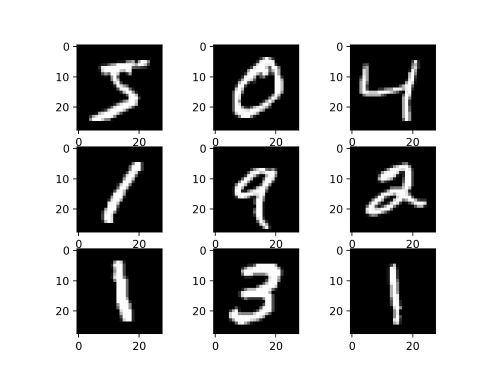<br>

여기에서는 **Fashion-MNIST** 를 사용하며, 이 데이터 셋은 MNIST와 달리 패션아이템으로 이루어진 데이터들로 이루어져 있습니다.
<br>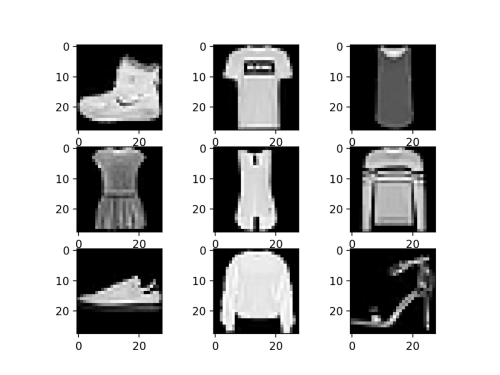<br>

tensorflow가 제공하는 keras 모듈에서 mnist 데이터, fashion-mnist 데이터를 불러올 수 있습니다
<br>Fashion-MNIST의 경우, load_data() 함수를 통해 훈련 데이터와 테스트 데이터를 나누어 반환 할 수 있습니다.
```python
import tensorflow as tf #from tensorflow import keras로도 불러올 수 있습니다.
(train_input, train_target), (test_input, test_target) = tf.keras.datasets.fashion_mnist.load_data()
```

<br>MNIST의 경우에도 load_data() 를 통해 훈련 데이터와 테스트 데이터를 불러올 수 있습니다.
```python
import tensorflow as tf
#이런 방식으로도 데이터를 저장할 수 있습니다.
data_train, data_test = tf.keras.datasets.mnist.load_data()

(train_input, train_target) = data_train
(test_input, test_target) = data_test
```


###### 인공 신경망(Artificial Neural Network, ANN)


**인공 신경망(Artificial Neural Network, ANN)** 은 뇌 속의 뉴런의 작용(신경망)을 본떠 만든 기계학습 모델입니다.
<br>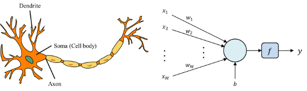<br>
<br>인공 신경망은 로지스틱 회귀 방식을 여러번 반복해준다는 것에서 로지스틱 회귀와 비슷합니다.
하지만 인공신경망은 로지스틱 회귀 알고리즘과달리 데이터의 특징을 수학적으로 표현하는 단계의 개수가 다릅니다.
로지스틱 회귀 알고리즘은 1개인 반면 인공 신경망은 2개 이상입니다.

<br>[❕ 로지스틱 회귀와 인공신경망의 차이][07-1_05]

<br>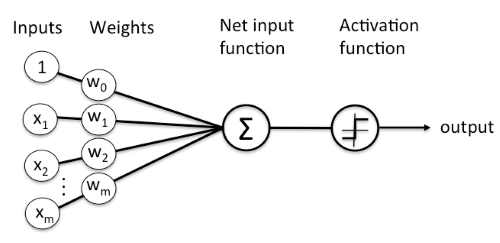<br>

**뉴런(neuron)** 은 다수의 입력 신호를 받아서 하나의 신호를 출력합니다.
인공신경망을 구성하는 기본단위이기도 합니다.
**유닛(unit)**, **퍼셉트론(perceptron)** 이라고 부르기도 합니다.

<br>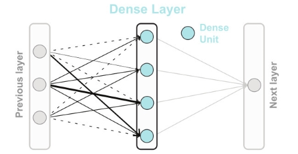<br>
▲[🖼️ 이미지 출처][07-1_06]<br>

인공 신경망에서 입력 벡터가 자리잡는 층을 **입력층(input layer)** 이라고 합니다.
입력층은 보통 입력받은 값 그 자체이고, 인공신경망 내에서 특별한 계산을 하지 않습니다.
참고로 주의해야 할 점은, 실제 인공 신경망에서 층의 개수를 셀 때는 입력층을 포함하지 않고 센다는 점입니다.
<br>또한, 인공 신경망에서 최종 출력값이 나오는 층을 **출력층(output layer)** 이라고 합니다.
<br>**밀집층(dense layer)** 은 이웃한 층의 뉴런들이 모두 연결되어 있는 층을 말합니다.
완전 연결층(Fully Connected Layer)라고 부르기도 합니다.


###### 인코딩(Encoding) : Label Encoding, One-hot Encoding

**범주형 자료(categorical data)** (고유한 값이나 범주의 수가 제한된 변수)는 데이터가 대부분 문자열로 되어있기 때문에 머신러닝 모델들은 그 데이터들을 이해하지 못합니다.
<br>이러기 위해서는 이 범주형 변수를 **수치형 변수(numerical data)** (관측된 값이 수치(숫자)로 측정되는 변수)로 바꾸어 줘야 합니다.
이 과정을 **인코딩(Encoding)** 이라고 하며, 인코딩 방법은 대표적으로 라벨 인코딩(Label Encoding), 원-핫 인코딩(one-hot encoding)이 있습니다.

<br><br>
▲[🖼️ 이미지 출처][07-1_07]<br>

<br><br>**Label Encoding** 은 n개의 범주형 데이터를 0~n-1(n개)의 연속적인 수치 데이터로 표현하는 방법입니다.
Label Encoding에서는 인코딩 된 데이터들 간의 차이가 수치적인 차이를 의미하는 것이 아니기에 주의해야 합니다.

<br>scikit-learn에서는 LabelEncoder 클래스를 통해 Label Encoding을 지원합니다.
```python
from sklearn.preprocessing import LabelEncoder

le = LabelEncoder()
le.fit(categorical_data) # fitting

le_encoded = le.transform(categorical_data) # 범주형 데이터를 인코딩
le.classes_ # 인코딩된 class를 확인
```

<br>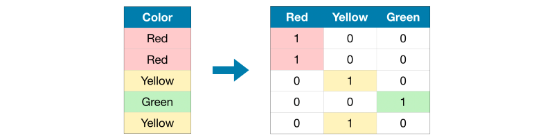<br>
▲[🖼️ 이미지 출처][07-1_07]<br>

<br>이와 달리 **One-hot Encoding** 은 n개의 범주형 데이터를 n배의 비트(0,1) 벡터 (ex) [1,0,0,0,0])로 표현합니다.
이는 서로 다른 범주 데이터를 독립적인 의미로 사용이 가능하게 합니다.

<br>scikit-learn에서는 OneHotEncoder 클래스를 통해 One-hot Encoding을 지원합니다.
```python
from sklearn.preprocessing import OneHotEncoder

ohe = OneHotEncoder(sparse=False) # sparse가 True일 경우 Matrix를 반환하며, False일 경우 array를 반환합니다.
ohe.fit(categorical_data) # fitting

ohe_encoded = ohe.transform(categorical_data) # 범주형 데이터를 인코딩
ohe.categories_ # 인코딩된 class 확인
```

One-hot Encoding은 Label Encoding 과 달리 여러 범주형 변수를 한번에 인코딩할 수 있다는 장점이 있습니다.
하지만 One-hot Encoding은 변수의 범주의 수가 증가할 수록 데이터의 양도 매우 많이 질수 있기 때문에 주의해야 합니다.
<br>[❕ 인코딩 방식에 대한 글][07-1_08]
<br>[❕ 인코딩 방식에 대한 글2][07-1_07]
<br><br>텐서플로우에서는 정수로 된 타깃 값을 원-핫 인코딩으로 바꾸지 않고 그냥 사용할 수 있습니다. 

### 07-2. 심층 신경망(Deep Neural Network, DNN) 🕸︎

###### 은닉층(hidden layer)

<br>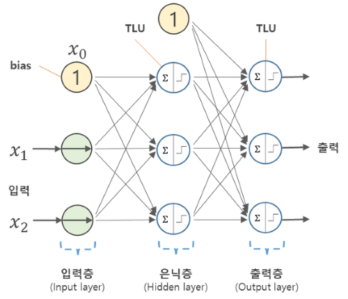<br>
▲[🖼️ 이미지 출처][07-1_06]<br>

입력층과 출력층 사이에 있는 모든 층을 **은닉층(hidden layer)** 이라고 합니다. 
은닉층에는 활성화 함수를 사용하는데 출력층에서 사용하는 활성화 함수와 달리 비교적 자유롭습니다.
은닉층에 활성화 함수(특히 비선형 함수)를 사용해야 하는 이유는 활성화 함수를 사용하지 않는다면(또는 선형 함수를 사용한다면) 은닉층을 사용하는 의미가 사라지게 되기 때문입니다.


###### 심층 신경망(Deep Neural Network, DNN)

**심층 신경망(Deep Neural Network, DNN)** 은 입력층과 출력층 사이에 여러개의 은닉층들로 이루어진 인공 신경망을 의미합니다.
<br>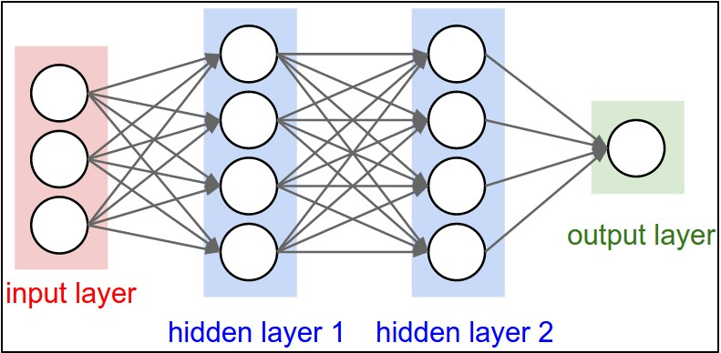<br>
은닉층에 한가지 제약이 있다면 적어도 출력층의 뉴런보다는 많게 만들어야 한다는 것입니다.
만약 은닉층의 각 층의 뉴런의 수가 출력층의 뉴련 개수보다 작아진다면 부족한 정보다 전달되는 문제가 발생할 것 입니다.

<br>심층 신경망과 기존에 배운 다른 모델들의 가장 큰 차이점은 바로 은닉층의 존재입니다.
인공 신경망의 성능은 층을 추가하여 입력데이터에 대해 연속적인 학습을 진행하는 능력에서 나옵니다. 

층을 추가하는 방법(여러가지 인가봄)

```python
from tensorflow import keras
dense1 = keras.layers.Dense(100, activation = 'sigmoid', input_shape = (784,))
dense2 = keras.layers.Dense(10, activation = 'softmax')
model = keras.Sequential([dense1,dense2])
```
다음과 같이 은닉층을 포함한 심층 신경망을 만들 수 있습니다.

<br>add() 메서드를 이용하여 모델에 층을 추가할 수도 있습니다.
```python
from tensorflow import keras
model = keras.Sequential()
model.add(keras.layers.Dense(100, activation = 'sigmoid', input_shape = (784,)))
model.add(keras.layers.Dense(10, activation = 'softmax'))
```

<br>이렇게 만든 모델은 summary() 메서드를 통해 확인 할 수 있습니다.
```python
model.summary()
```


###### 활성화 함수

**활성화 함수(Activation function)** 는 입력된 데이터의 합을 출력 신호로 변환할 때 사용하는 함수입니다.


그 중 하나인 **시그모이드 함수(sigmoid)** 의 함수 식은 다음과 같습니다.
<br><br>
<br>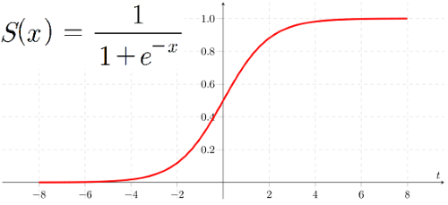<br>

모든 실수 값을 0에서 1 사이로 반환해준다는 특징을 가지고 있습니다.
<br>하지만 이 함수는 은닉층의 깊이가 깊으면 오차율을 계산하기 어렵다는 문제가 발생합니다.
또한 학습이 느려질 수 있다는 단점이 있습니다.

**ReLU 함수** 는 조금더 함수 식이 간단합니다.
<br>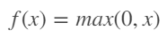<br>
<br>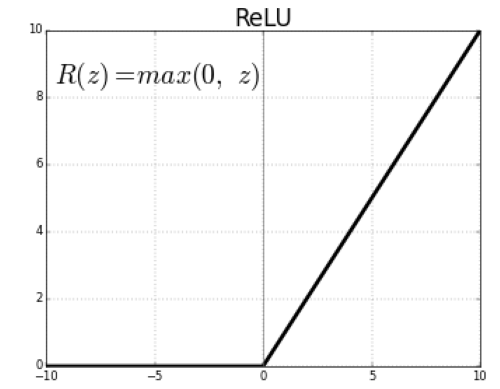<br>
가장 많이 사용되는 활성화 함수 중 하나입니다. 다른 활성화 함수보다 학습이 빠르고, 연산 비용이 적고, 구현이 매우 간단하다는 특징을 가지고 있습니다.
하지만 값이 0보다 작은 값이 들어올경우 함수 값이 0이 되어 뉴런이 죽어버릴 수 있다는 단점을 지니고 있습니다.


이 외에도 다양한 활성화 함수가 존재한다. 활성화 함수는 각각 특징이 있기 때문에 상황에 맞춰 사용해야 한다.
<br>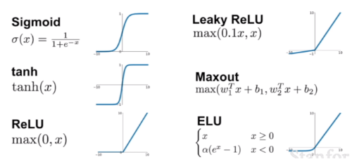<br>
▲[🖼️ 이미지 출처][07-2_01]<br>

<br>[❕ 다양한 활성화 함수에 대한 설명][07-2_01]


keras에서는 Dense의 매개변수 activation 을 이용해 활성화 함수를 어떤 것으로 할지 정할 수 있습니다.
```python
from tensorflow import keras

model = keras.Sequential()
model.add(keras.layers.Dense(10, activation = 'softmax'))
```

###### 옵티마이저(optimizer)

기존에 배웠던 모델들에서 하이퍼파라미터는 모델이 학습하지 않아 사람이 지정해줘야 합니다.
특히, 은닉층이 포함된 인공 신경망의 경우 이런 하이퍼파라미터의 수가 엄청나게 많아지게 됩니다.
이런 파라미터들을 조정할 때 가장 쉽게 바꿔주는 것을 **옵티마이저(optimizer)** 라고 합니다.

<br>옵티마이저는 학습 데이터를 이용하여 모델을 예측한 결과와 실제 경과를 비교한 것을 기반으로 오차를 줄일 수 있게 만들어 줍니다.
옵티마이저의 종류는 여러 가지입니다.

**모멘텀 최적화(momentum optimization)** 는 볼링공과 같이 처음에는 느리게 시작하지만 시간이 지날수록 빠르게 가속된다는 특징을 지니고 있습니다.
<br>**네스테로프 모멘텀 최적화(nesterov momentum optimization)** 는 그래디언트를 현재 위치의 그래디언트가 아닌 현재 위치에서 어느정도의 속도만큼 전진한 후의 그래티언트를 사용합니다.

keras를 이용해 이; 두가지를 이용할 수 있습니다.

```python
sgd = keras.optimizers.SGD(momentum=0.9, nesterov=True)
#nesterov를 True로 하면 네스테로프 모멘텀을 사용하며 False를 사용하면 모멘텀을 사용합니다.
```

<br>이 때, **적응적 학습률(adaptive learning rate)** 를 이용해 자신의 현재 상황에 따라 학습률을 조정할 수 있습니다.

<br>[❕ 모멘텀과 네스테로프 모멘텀의 차이][07-2_03]

<br><br>
<br>[❕ 다양한 옵티마이저에 대한 설명][07-2_02]


### 07-3. 신경망 모델 훈련 🏋️

###### 손실 곡선

keras의 fit() 메서드에서는 History 클래스 객체를 반환합니다.
History 객체에는 훈련 과정에서 계산한 지표, 즉 손실과 정확도 값이 저장되어 있습니다.
여기에 담겨있는 데이터를 이용하면 손실곡선을 그릴 수 있습니다.

```python
from tensorflow import keras

def model_fn(a_layer=None):
    model = keras.Sequential()
    model.add(keras.layers.Flatten(input_shape=(28, 28)))
    model.add(keras.layers.Dense(100, activation='relu'))
    if a_layer:
        model.add(a_layer)
    model.add(keras.layers.Dense(10, activation='softmax'))
    return model

model = model_fn()
model.compile(loss='sparse_categorical_crossentropy', metrics='accuracy')

history = model.fit(train_scaled, train_target, epochs=20, verbose=0)
plt.plot(history.history['loss'])
plt.xlabel('epoch')
plt.ylabel('loss')
plt.show()
```

<br>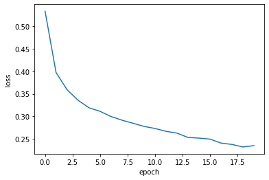<br>

###### 드롭아웃(dropout)

**드롭아웃(dropout)** 은 훈련 과정 중에서 층에 있는 일부 뉴런을 랜덤하게 끄는 방법입니다.
이는 이전 층의 일부 뉴런이 랜덤하게 꺼지면 특정 뉴런에 과대하게 의존하는 것을 막을 수 있어 과대적합을 막을 수 있습니다.
따라서 드롭아웃을 이용하면 더 안정적인 예측을 만들 수 있습니다.

Keras에서 Dropout 객체를 이용해 드롭아웃을 적용할 수 있습니다.

```python
model.add(keras.layers.Dropout(0.3))
```

###### 모델의 저장과 복원

Keras에서는 모델의 파라미터를 저장하는 save_weights() 메서드를 제공합니다.

```python
model.save_weights('weights.h5')
```

또한 load_weights를 이용하여 저장한 모델의 파라미터를 불러올 수 있습니다.
이때, 불러올 파라미터의 모델과 저장할 모델은 같은 구조를 지니고 있어야 합니다.

```python
model.load_weights('weight.h5')
```

###### 콜백(callback)

**콜백(callback)** 은 훈련 과정 중간에 어떤 작업을 수행할 수 있게 하는 keras.callbacks 패키기 아래에 있는 클래스들입니다.

또한 과대적합이 일어나기 전에 훈련을 미리 중지하는 것을 **조기 종료(early stopping)** 라고 합니다.


<br>[❕ XGBoost 공식 문서][ex]
<br><br>
▲[🖼️ 이미지 출처][06-1_01]<br>

[ex]: https://tensorflow.blog/파이썬-머신러닝/2-3-5-결정-트리/
[07-1_01]: https://www.tensorflow.org/
[07-1_02]: https://blog.tensorflow.org/
[07-1_03]: https://www.tensorflow.org/api_docs
[07-1_04]: https://tensorflow.blog/
[07-1_05]: https://m.blog.naver.com/seongcheol02/221774416395
[07-1_06]: https://aimb.tistory.com/253
[07-1_07]: https://www.kaggle.com/code/alexisbcook/categorical-variables/tutorial
[07-1_08]: https://leehah0908.tistory.com/7

[07-2_01]: https://m.blog.naver.com/PostView.naver?isHttpsRedirect=true&blogId=handuelly&logNo=221824080339
[07-2_02]: https://dbstndi6316.tistory.com/297
[07-2_03]: https://tensorflow.blog/2017/03/22/momentum-nesterov-momentum/