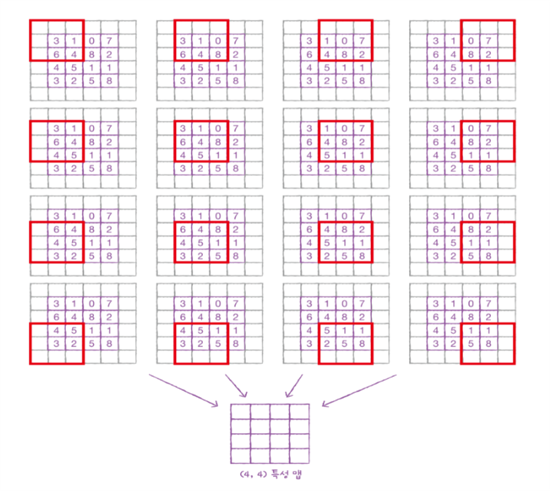

# 합성곱 신경망의 전체 구조


<br/></br>

# convolutional layer

```python
from tensorflow import keras
keras.layers.Conv2D(10, kernel_size=(3,3), activation='relu')
```

위의 코드는 이미지를 input으로 받는 합성곱 층을 의미한다. 첫 번째 매개변수 '10' 은 필터의 개수를 의미하며 kernel_size 는 보통(3, 3) 또는 (5, 5) 를 사용한다.

## padding

다음의 이미지는 padding 작업을 직관적으로 나타낸다.



입력 배열 주위를 가상의 원소로 채우는 것을 padding 이라고 하며 실제 데이터가 아니기에 0 으로 채운다.

이미지에서 보이는 경우는 (4, 4) 입력과 동일한 크기의 출력을 하기 위해 same padding 을 적용했다. 대조적으로 패딩 없이 순수한 입력 배열에서만 합성곱을 하여 특성 맵을 만드는 경우를 valid padding 이라고 한다.

padding을 사용하지 않은 경우, 중앙부와 모서리 픽셀이 합성곱에 참여하는 비율이 차이가 난다. 합성곱에 비교적 균등하게 이미지의 모든 픽셀이 참여하기 위해 padding을 사용한다.

## stride

stride는 kernel 이 이동하는 크기를 의미하며 (1, 1) 과 같이, 좌우, 상하 이동 크기를 지정한다.
<br/></br>

# Pooling Layer

pooling 은 차원의 개수는 유지하되, 크기를 줄이는 방식을 의미한다. 맵핑하는 영역에서 가장 큰 값을 고르는 방식을 max pooling, 평균값을 고르는 방식을 average pooling 이라고 한다. average pooling 은 특성 맵에 있는 중요한 정보를 평균하여 희석시킬 수 있기 때문에 대부분의 경우 maxpooling 을 사용한다.

```python
# MaxPooling  예시 코드
keras.layers.MaxPooling2D(2, strides=2, padding='valid')
```
- 첫 번째 매개변수: 풀링의 크기
- strides : 기본값은 풀링의 크기
- padding: 'valid' 지정 -> 패딩을 지정하지 않는다.
<br/></br>

# fully-connected Layer

일반적인 DNN 과 동일하게, 활성화 함수를 가진 layer를 데이터가 순차적으로 통과하고 마지막에 sigmoid 또는 softmax 를 거쳐 출력되는 구조이다. Dropout 과 같은 layer를 추가할 수 있다.
<br/></br>

# CNN 전체 코드

Sequential 방식으로 구현한 합성곱 신경망 구조는 다음과 같다.

```python
# first convolutional - pooling layer
model = keras.Sequential()
model.add(keras.layers.Conv2D(32, kernel_size=3, activation='relu',
                              padding='same', input_shape=(28,28,1)))
model.add(keras.layers.MaxPooling2D(2))

# feature map shape : (14, 14, 32)
# second convolutional - pooling layer
model.add(keras.layers.Conv2D(64, kernel_size=3, activation='relu',
                              padding='same'))
model.add(keras.layers.MaxPooling2D(2))

# output shape : (7, 7, 64)
# fully-connected layer
model.add(keras.layers.Flatten())
model.add(keras.layers.Dense(100, activation='relu'))  # the number of neurons : 100
model.add(keras.layers.Dropout(0.4))
model.add(keras.layers.Dense(10, activation='softmax'))
```

모델 컴파일과 훈련은 MLP 와 동일하다. 