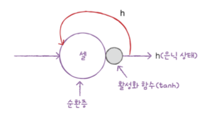
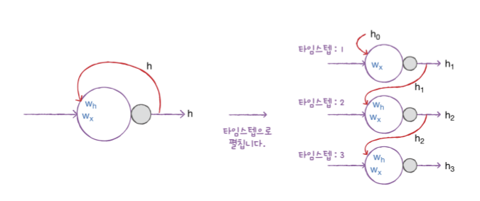
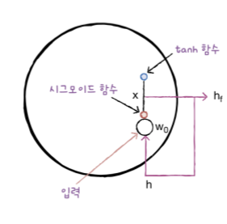
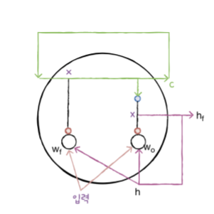
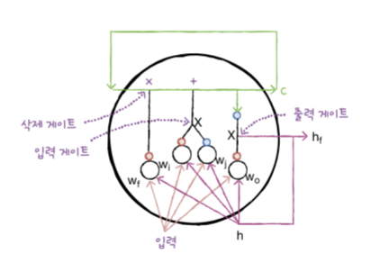
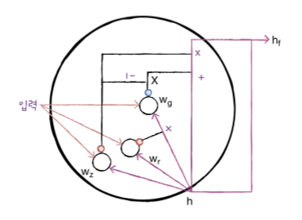

# RNN ; recurrent neural network

## 순차 데이터(Sequential data)

순차 데이터는 텍스트나 시게열과 같이 순서에 의미가 있는 데이터이다. 이런 특징의 데이터는 순서를 유지하면서 신경망에 주입해야 한다. 순차 데이터를 다루는 신경망은 일반적인 feedforward network 가 아닌 순차 데이터가 신경망 층에서 순환되는 구조가 되어야 한다.


## 순환 신경망

순환 신경망은 완전 연결 신경망에 이전 데이터의 처리 흐름을 순환하는 고리 하나만 추가하면 된다. 

순환신경망에서 도입하는 몇 가지 개념은 다음과 같다.

* time step: 순환 신경망에서 샘플을 처리하는 한 단계.
* cell : layer와 동일, 하나의 cell 은 여러 개의 뉴런으로 연결되어 있고, 하나의 cell로 표현한다.
* hidden_state(은닉 상태) : 셀의 출력

아래 이미지는 순환 신경망의 하나의 cell을 나타낸다.



순환 신경망에서 학습의 흐름은 다음 이미지에서 나타난다.



가중치 ${w_h}$ 는 time step 에 따라 변화하는 뉴런의 출력을 학습한다.
<br/></br>

# IMDB review classification

영화 리뷰 감성 분석은 순환 신경망을 이용하는 대표적인 사례이다. IMDB 리뷰 데이터셋을 바닐라RNN 모델을 통해 긍정/부정 리뷰인지 판별하는 binary classification 을 해보겠다.

## data set

* IMDB 리뷰 데이터셋은 총 50,000개의 샘플, 훈련 데이터와 테스트 데이터 각각 25,000개씩 나뉘어 있다.
* 일반적으로 영어 문장은 모두 소문자로 바꾸고 구둣점을 삭제한 다음공백을 기준으로 분리한다. 이렇게 분리된 단어를 토큰이라고 부른다. 하나의 문장은 여러 개의 토큰으로 이루어져 있다.
* tensorflow.keras.datasets 에는 이미 정수 인코딩이 처리된 리뷰 데이터셋을 제공한다.


```python
from tensorflow.keras.datasets import imdb

# 전체 데이터셋에서 가장 자주 등장하는 단어 500개만 사용.
(train_input, train_target), (test_input, test_target) = imdb.load_data(num_words=500)

# validation set(20% of train data)
from sklearn.model_selection import train_test_split
train_input, val_input, train_target, val_target = train_test_split(
    train_input, train_target, test_size=0.2, random_state=42)
```

훈련 데이터를 살펴보면, 데이터의 특징을 이해하는데 도움이 된다. 우선 각 리뷰의 길이를 계산해서 넘파이 배열에 담고, 평균적인 리뷰의 길이와 가장 짧은 리뷰의 길이, 가장 긴 리뷰의 길이를 확인한다. 이러한 조사는 padding 작업에 용이할 것이다.

```python
import numpy as np
lengths = np.array([len(x) for x in train_input])
print(np.mean(lengths), np.median(lengths))

>>> 239.00925  178.0

# histogram 으로 리뷰 길이 분포 표현
import matplotlib.pyplot as plt
plt.hist(lengths)
plt.xlabel('length')
plt.ylabel('frequency')
plt.show
```
위 결과를 살펴보면, 대부분의 리뷰 길이가 300 미만이다. 100개의 단어를 기준으로 리뷰 길이가 100 보다 짧은 경우 0으로 패딩할 계획이다. 패딩은 다음의 코드로 진행된다.

```python
from tensorflow.keras.preprocessing.sequence import pad_sequences
train_seq = pad_sequences(train_input, maxlen=100)

# validation set 또한 각 리뷰의 길이를 100으로 설정.
val_seq = pad_sequences(val_input, maxlen=100)
```

다음으로 순환 신경망 모델을 생성하고 훈련 까지 진행한다.

```python
from tensorflow import keras
model = keras.Sequential()
model.add(keras.layers.SimpleRNN(8, input_shape=(100,500)))
model.add(keras.layers.Dense(1, activation='sigmoid'))

# one-hot encoding
train_oh = keras.utils.to_categorical(train_seq)
val_oh = keras.utils.to_categorical(val_seq)

# compile & fit
rmsprop = keras.optimizers.RMSprop(learning_rate=1e-4)
model.compile(optimizer=rmsprop, loss='binary_crossentropy', metrics=['accuracy'],)
early_stopping_cb = keras.callbacks.EarlyStopping(patience=3)
model.fit(train_oh, train_target, epochs=100, batch_size=64, 
            validation_data=(val_oh, val_target),
            callbacks=[early_stopping_cb])
```
<br/></br>

# LSTM

LSTM : long short-term memory, 단기 기억을 장기 기억하기 위해 고안된 모델이다. LSMT 의 은 gate 라는 개념을 사용해서 모델을 구조화한다. 구조에 대한 설명은 다음과 같다.

- 은닉 상태는 입력과 이전 타임스텝의 은닉상태를 가중치에 곱한 후 활성화 함수를 통과시켜 다음 은닉 상태를 만든다. 시그모이드 활성화 함수를 사용한다.

    

* LSTM 에는 순환되는 상태(state)가 2개 이다. hidden state가 아닌 cell state 라고 부르는 값이 있다. 셀 상태는 다음 층으로 전달되지 않고 lstm 셀에서 순환 되는 값이다. 셀 상태를 구하기 위해선 다음의 과정을 거친다. 

  * 우선 입력과 은닉상태를 또 다른 가중치 $w_h$ 에 곱한 다음 시그모이드 함수를 통과시킨다.
  * 그다음, 이전 타임스텝의 셀 상태와 곱하여 새로운 셀 상태를 만든다.
  * 이 셀 상태가 오른쪽에서 tanh 함수를 통과하여 새로운 은닉 상태를 만드는 데 기여한다. 

    

* LSTM 에는 2개의 작은 셀이 더 추가된다. 이전과 마찬가지로 입력과 은닉 상태를 곱한 다음, 하나는 시그모이드 함수를 통과시키고 다른 하나는 tanh 함수를 통과시킨다. 그 다음, 두 결과를 곱한 후 이전 상태와 더한다.

* 최종적인 셀의 상태
  
  

  * 삭제 게이트: 셀 상태에 있는 정보를 제거하는 역할을 한다.
  * 입력 게이트: 새로운 정보를 셀 상태에 추가한다.
  * 출력 게이트: 이 셀 상태가 다음 은닉 상태로 출력한다.
<br/></br>

# GRU

GRU: gated recurrent unit 은 LSTM 을 간소화한 버전으로, 셀 상태를 계산하지 않고 은닉 상태 하나만 포함하고 있다. 구조는 다음과 같다.



$w_z$ 를 사용하는 셀의 출력이 은닉 상태에 바로 곱해져 삭제 게이트 역할을 수행한다.

$w_z$의 출력에서 1을 뺀 다음, 가장 오른쪽 $w_g$ 를 사용하는 셀의 출력에 곱하면, 입력되는 정보를 제어하는 역할을 수행한다.

$w_f$ 를 사용하는 셀에서 출력되는 값은 $w_g$ 셀이 사용할 은닉 상태의 정보를 제어한다.